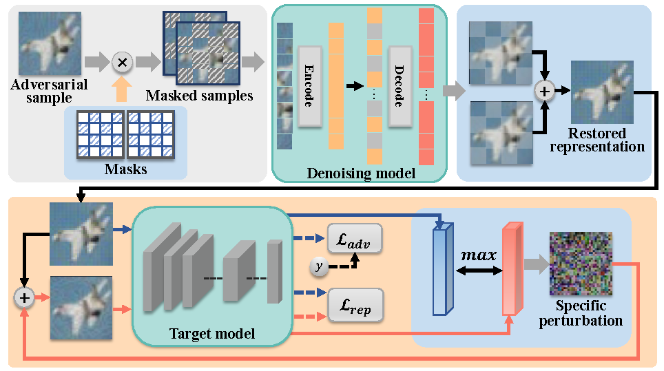

<div align="center">   
  
# Eliminating Adversarial Noise via Information Discard and Robust Representation Restoration
[](https://proceedings.mlr.press/v202/zhou23b/zhou23b.pdf)

</div>

The implementation of [Eliminating Adversarial Noise via Information Discard and Robust Representation Restoration](https://proceedings.mlr.press/v202/zhou23b/zhou23b.pdf) (ICML 2023).

Deep neural networks (DNNs) are vulnerable to adversarial noise. Denoising model-based defense is a major protection strategy. However, denoising models may fail and induce negative effects in fully white-box scenarios. In this work, we start from the latent inherent properties of adversarial samples to break the limitations. Unlike solely learning a mapping from adversarial samples to natural samples, we aim to achieve denoising by *destroying the spatial characteristics of adversarial noise* and *preserving the robust features of natural information*. Motivated by this, we propose a defense based on information discard and robust representation restoration. Our method utilize complementary masks to disrupt adversarial noise and guided denoising models to restore robust-predictive representations from masked samples. Experimental results show that our method has competitive performance against white-box attacks and effectively reverses the negative effect of denoising models.


<p float="left" align="center">
 
<figcaption align="center">
Difference between the proposed denoising model and general denoising model. Instead of directly bring the restored representations close to the natural samples, the proposed approach was dedicated to disrupting adversarial noise via complementary masks, and guiding the restored representations to sufficiently capture robust and predictive features in natural information.
</figcaption>
</p>


<p float="left" align="center">
 
<figcaption align="center">
  
The schematic diagram of the proposed method. Our method constructed a defensive Denoising model based on Information discarding and Robust representation restoration (DIR). The information discard was performed to destroy the spatial characteristics of adversarial noise by introducing random and complementary masks on adversarial samples. To restore robust representations from the latent robust features of natural information, a game-based mechanism was designed. We crafted specific perturbations on restored representations to maximize the distance (e.g., KL divergence) between original representations and perturbed representations in the decision space (see blue box at the bottom). Adversarially, the denoising model was optimized to minimize the distance by minimizing $\mathcal{L}\_{rep}$. In addition, we performed adversarial training on the denoising model by minimizing $\mathcal{L}\_{adv}$. The adversarial samples used are crafted against the ensemble of the denoising model and target model.
</p>


## Requirements
- This codebase is written for `python3` and `pytorch`.
- To install necessary python packages, run `pip install -r requirements.txt`.


## Experiments
### Data
- Please download and place the dataset into the 'data' directory.
- Craft your adversarial samples (e.g., using PGD attack against standard adversasrially trained model).


### Training
- To pre-train the denoising model using the natural samples and your adversarial samples

```
python pre_training.py
```

The model's architecture is presented in 'pretrain_model.py'. Save the pre-trained model in 'the directory of your checkpoint for the pre-trained model'. In addition, you can choose a larger epoch (>600) to get better reconstruction results (but it requires more time cost).


- To train the DIR model using the pre-trained model

```
python train.py
```
Note that the learning rates of the denoising model and the classification model are set to be different.


## License and Contributing
- This README is formatted based on [paperswithcode](https://github.com/paperswithcode/releasing-research-code).
- Feel free to post issues via Github. 


## Reference
If you find the code useful in your research, please consider citing our paper:


<pre>

@InProceedings{pmlr-v202-zhou23b,
  title = 	 {Eliminating Adversarial Noise via Information Discard and Robust Representation Restoration},
  author =       {Zhou, Dawei and Chen, Yukun and Wang, Nannan and Liu, Decheng and Gao, Xinbo and Liu, Tongliang},
  booktitle = 	 {Proceedings of the 40th International Conference on Machine Learning},
  pages = 	 {42517--42530},
  year = 	 {2023},
  publisher =    {PMLR}
}

</pre>

